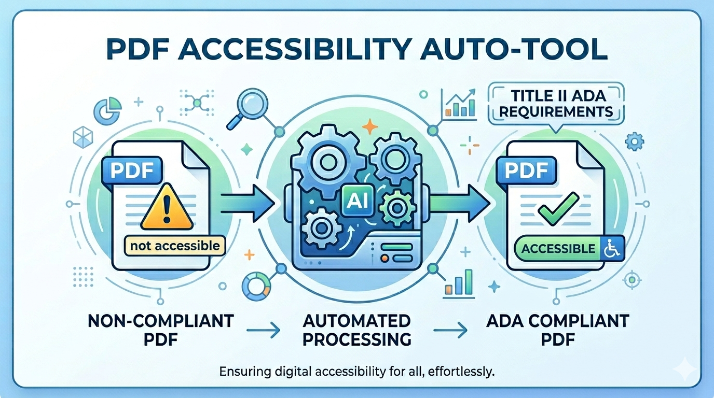

# PDF Accessibility Tool for Title II ADA Requirements


Best-effort remediation tool for already tagged PDFs, designed to help move exported PDFs closer to Title II ADA accessibility requirements.



You can use either Acrobat Pro or opensource tools to generate such a tagged PDF.

## Files

- `pdf_accessibility_auto.py`
- `requirements.txt`

## What the script does

The script works on PDFs that already contain a `/StructTreeRoot` (by tagging) and attempts to improve common accessibility gaps by:

- adding `/Alt` text to tagged `Figure`, `Table`, and `Formula` elements
- adding `/Summary` text to tagged tables
- removing nested `/Alt`, `/ActualText`, and `/Summary` values under those elements
- promoting missing table headers from `TD` to `TH`
- promoting likely headings from `P` to `H1`, `H2`, and `H3`
- setting PDF title metadata, with `"Thesis"` as the default title
- setting PDF language metadata

## What it does not do

This tool does not build a full accessibility tag tree from an untagged PDF.

If a PDF does not already have a valid `/StructTreeRoot`, this script is not the right starting point. Please use either Acrobat Pro or opensource tools to generate such a tagged PDF.

## Requirements

- Python 3.10+
- PyMuPDF
- pypdf

Install dependencies:

```bash
pip install -r requirements.txt
```

## Basic usage

```bash
python pdf_accessibility_auto.py input.pdf -o output.pdf
```

By default, the output PDF title metadata is set to `"Thesis"`.

Set title and language:

```bash
python pdf_accessibility_auto.py input.pdf -o output.pdf --title "Document Title" --lang en-US
```

Disable some heuristic transformations:

```bash
python pdf_accessibility_auto.py input.pdf -o output.pdf --disable-heading-promotion --disable-table-header-promotion
```

## Output

Besides the output PDF, the script prints a JSON summary with:

- missing alt-text counts before and after
- number of promoted heading tags
- number of promoted table header cells
- metadata values applied

## Notes

- The heading and table-header fixes are heuristic.
- This tool is intended as a practical post-processing step, not a PDF/UA certification pipeline.
